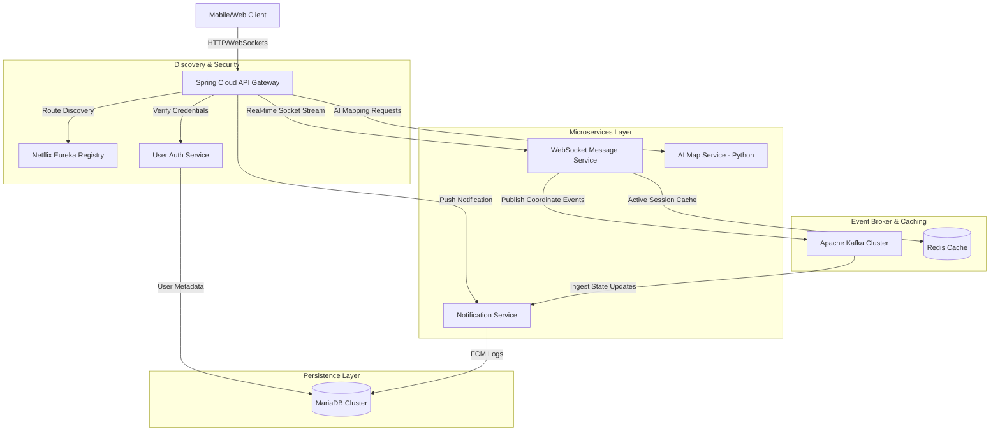

# Traverse Backend Microservices 🧭⚙️
> **Resilient Distributed Event-Driven Architecture for Real-Time Geolocation Tracking & Alerts**

[](https://spring.io/projects/spring-cloud)
[](https://java.com/)
[](https://kafka.apache.org/)
[](https://mariadb.org/)
[](https://github.com/features/actions)
[](https://www.docker.com/)

**Traverse Backend** is a highly scalable, event-driven microservices architecture designed to ingest, process, cache, and distribute live geolocation coordinates and alert states. Orchestrated with **Spring Cloud** and **Docker Compose**, the platform routes low-latency traffic, manages distributed session states, and fires push notifications reliably under high concurrency.

---

## 🏗️ Distributed System Architecture



---

## 🛠️ Microservice Directory & Component Breakdown

* **`eureka` (Netflix Eureka Server)**: Centrally coordinates dynamic service discovery and heartbeat monitoring for all microservices.
* **`api-gateway` (Spring Cloud Gateway)**: Serves as the single entry point. Handles load balancing, JWT authentication filters, and routing rules.
* **`message-service` (WebSocket Messaging)**: Handles live Socket.io tunnels, coordinates coordinate streaming, and caches active session mappings to Redis.
* **`notification-service` (Push Notifications)**: Directs real-time push alerts to paired client devices using **Firebase Cloud Messaging (FCM)**.
* **`aiMap` (AI-Assisted Mapping Service)**: Independent **Python FastAPI** microservice managing geospatial queries and AI routing matrices.
* **`admin_gradle` (System Control Board)**: Dedicated management dashboard microservice to supervise cluster health, system logs, and pair quotas.
* **`db-init`**: Containerized database initializer structuring relational schemas and index properties automatically on startup.

---

## ✨ Features

* **Low-Latency Event Streaming**: Employs **Apache Kafka** to distribute coordinate events and system logs asynchronously, decoupling microservices.
* **Service Discovery & Resilient Routing**: Utilizes **Netflix Eureka** to register microservices dynamically, ensuring zero downtime during scaling.
* **High-Availability Session Caching**: Leverages **Redis** to store temporary active device pairing states and geofence locations.
* **Distributed Auth Flow**: Integrates secure JWT evaluation directly within the API Gateway filters.
* **Automatic DB Schema Migration**: Containerized SQL controllers setting relational environments automatically.
* **Agile CI/CD Pipelines**: Automatic container builds and updates driven by **GitHub Actions** and hosted on an private **Ubuntu (Raspberry Pi 4 8GB)** server.

---

## ⚡ Technical Challenges & Achievements

### 1. Handling High-Volume Geolocation Ingestion without Database Overload
* **Challenge**: Writing continuous coordinate broadcasts directly to relational databases triggers massive CPU spikes and table locks.
* **Solution**: Implemented a two-stage ingestion pipeline. Real-time geolocations from the `message-service` are cached in an in-memory **Redis** cluster with a rolling TTL of 1 hour, while coordinate changes are published to **Apache Kafka**. The `notification-service` consumes Kafka events asynchronously to trigger alerts, keeping MariaDB disk write operations near zero during active tracking.

### 2. Spring Cloud API Gateway JWT Authentication Filter
* **Challenge**: Checking user credentials independently in every microservice creates code duplication and latency overhead.
* **Solution**: Developed a global Custom Gateway Filter. The API Gateway intercepts all incoming REST and Socket requests, validates JWT headers with the `User Auth Service`, and appends token payloads as upstream headers, keeping downstream services lightweight and secure.

---

## 🚀 Getting Started

### Prerequisites
* **Java 17+** (for Spring services)
* **Python 3.10+** (for aiMap FastAPI)
* **Docker & Docker Compose**

### Running the Microservices Cluster
The entire distributed cluster is fully orchestrated via Docker Compose:
1. Clone the project:
   ```bash
   git clone https://github.com/TheSoftBelly/traverse_backend.git
   cd traverse_backend
   ```
2. Configure Firebase credentials by adding your JSON configuration file in the project root:
   `tabtalk-c3dc3-firebase-adminsdk-fbsvc-25c323ffdc.json`
3. Spin up all infrastructure and microservices with a single command:
   ```bash
   docker compose up --build -d
   ```
4. Check cluster status via Eureka dashboard at `http://localhost:8761`!

---

## 📄 License
Private - All rights reserved.  
Copyright (c) 2026 HyoJoon Oh (TheSoftBelly).
